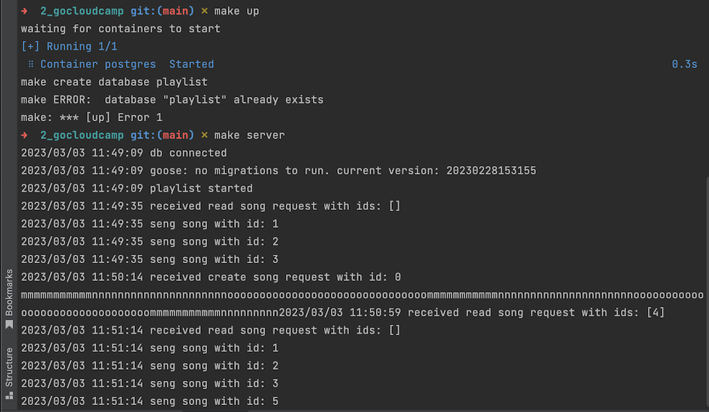

# Задание

Тестовое задание для поступления в GoCloudCamp [смотри здесь](TASK.md)


## 1. Вопросы для разогрева

_Опишите самую интересную задачу в программировании, которую вам приходилось решать?_

Разработал (в команде сначала из 2, затем из 4 человек) и успешно внедрил программно-аппаратный комплекс технической сигнализации (Python, MySQL), что позволило:
- увеличить число абонентских точек в 2,5 раза (до 1000+) с возможностью дальнейшего расширения
- увеличить оперативность реагирования на происшествия для диспечерских служб организации в 5-10 раз за счет визуализации на карте города, ввода реальных обозначений вместо условных, вывода инструкций и т.п.
- ввести автоматизированное логирование инцидентов
- снизить нагрузку на диспечерскую службу при проведении плановых работ за счет выноса части функционала на отдельные терминалы отделов

_Расскажите о своем самом большом факапе? Что вы предприняли для решения проблемы?_

- **из связанного с IT** - не проверил привязку логических дисков к физическим (в windows это можно тоже поменять, как оказалось) и поставил свежую винду на диск с архивами документов. Бэкап оказался старым :(, вытащить с помощью рекавер утилит получилось далеко не все. Пришлось сканировать документы за несколько месяцев работы.
- **из остального** - на базе отдыха, удаленной от цивилизации на 100 км, полез в схему, в которой понимал мало, и уронил в скважину погружной насос. Пока нашел того, кто соображает - сидели без воды.

_Каковы ваши ожидания от участия в буткемпе?_

- улучшить навыки в инфраструктуре вокруг Go и получить ревью своего кода
- поработать над реальными проектами
- устроиться на работу

## 2. Разработка музыкального плейлиста

### Часть 1. Разработка основного модуля работы с плейлистом

Модуль находится в `internal/domain/playlist`, реализованы:

- Play, Pause, AddSong, Next, Prev
- табличные юнит-тесты в `internal/domain/playlist`

Демоплеер находится в `internal/player`, реализован на горутине, контролы не блокируются:

- при включении воспроизведения спамит в stdout первым символом названия песни, затем засыпает на SongTick миллисекунд. 

*Например, для плейлиста из двух песен aaa (duration=1sec) и bbbbb (duration=2s) при SongTick=100, воспроизведение будет aaaaaaaaaabbbbbbbbbbbbbbbbbbbbaaa...*

- воспроизведение реализовано цикличное, при окончании последней песни начинается первая

Написаны тесты (табличные по минимуму), запуск `make test`

Написан test CLI, находится в `cmd/testcli`, запуск через `make testcli`

#### Пример запуска

```bash
Player demo
p play, s stop, n next, b back, a add, q quit
name: 111
duration (sec): 1
p play, s stop, n next, b back, a add, q quit
name: 222
duration (sec): 2
p play, s stop, n next, b back, a add, q quit
play: OK
p play, s stop, n next, b back, a add, q quit
1111111111122222222222222222222211111111111222222222222222222222111111111112222222222222222222221111111111122222222222222222222211111111111222222222
pause: OK
p play, s stop, n next, b back, a add, q quit
play: OK
p play, s stop, n next, b back, a add, q quit
2222222222221111111111122222222222222222222211111111111222222222222222222222111
pause: OK
p play, s stop, n next, b back, a add, q quit
play: OK
p play, s stop, n next, b back, a add, q quit
11111111222222222222222222222111111111112222222222222222222221111111111122222222
next: song: 111
p play, s stop, n next, b back, a add, q quit
1111111111222
next: song: 111
p play, s stop, n next, b back, a add, q quit
111111
next: song: 222
p play, s stop, n next, b back, a add, q quit
22222
next: song: 111
p play, s stop, n next, b back, a add, q quit
11111
prev: song: 222
p play, s stop, n next, b back, a add, q quit
22
prev: song: 111
p play, s stop, n next, b back, a add, q quit
111111111122222
prev: song: 111
p play, s stop, n next, b back, a add, q quit
1
prev: song: 222
p play, s stop, n next, b back, a add, q quit
22222222222222222222211111111111222222222222222222222111111111
```

### Часть 2: Построение API для музыкального плейлиста

Реализовано:

1. Хранение плейлиста в postgres. Старт контейнера через `make up`, стоп через `make down`

> В секции стоит задержка 10 секунд для ожидания старта контейнеров, чтобы успешно выполнить `CREATE DATABASE playlist`.
> Если база не создалась (10 секунд не хватило на запуск контейнера), выполните `make up` повторно.

2. Миграция (только одна пока, создание таблиц) через `github.com/pressly/goose` при старте сервиса, лежит в `migrations` 

3. сервис и клиент для управления плейлистом

- запуск сервера `make server`
- запуск клиента `make client`
- CRUD и Control (play, pause, next, prev) операции
- транспорт через gRPC:
  - .proto лежат в `api`, генерируются в `pkg/plservice`, перегенерировать можно через `make gen`
  - хендлеры описаны в `internal/handlers/plservice`

#### Пример запуска

Сервер



Клиент


### Дополнительно

- в make реализованы precommit проверки через `make precommit`:
  - проверка сборки
  - проверка тестов
  - проверка golangci-lint

### ТОDO

Что не удалось выполнить (поздно узнал про буткамп)

1. обернуть сервисы в контейнеры и compose (билд/релиз секции)
2. все хорошенько проверить :)
3. написать тесты для gRPC
4. написать тесты для репозитория
